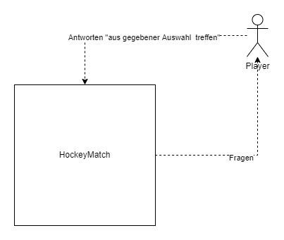
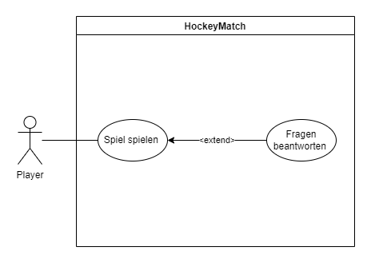
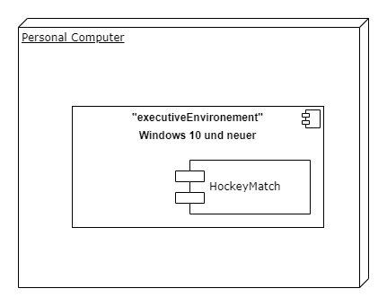

# SWA-Hausaufgaben
SWA-Hausaufgaben
**Architekturdokumentation der Software Lineares Spiel Hockeymatch**

# Einführung

Es war unser Ziel ein Lineares Textbasiertes Spiel zu erstellen um jedermann 5 – 10 Minuten zu überbrücken zu können. Das Thema war ein Hockeymatch bei welchem die Teams Eishokey Club Biel (EHCB) und Schlitschuh Club Bern (SCB) in den letzten 15 Sekunden des finalen Spiels zeigt. 

# Kontextabgrenzung
*Kontext-Diagramm und Beschreibung.*

Beschreibung: der Player Spiel den HockeyMatch. Das Spiel läuft 

# Anforderungen
## Funktionale Anforderungen

Beschreibung: der Player startet das Spiel und navigiert sich anschliessend durch die verschiedenen Fragen durch den Spielverlauf. Bei einer falschen Eingabe beginnt man von Anfang an. Der Player kann das Spiel jederzeit beenden. 

- Step1. Der Player startet das Spiel
- Step2. HockeyMatch stellt dem Player Fragen
- Step3. Der Player beantwortet die Frage.
- Step4a. HockeyMatch stellt die nächste Frage --> Step 3.
- Step4b. HockeyMatch hat keine Fragen mehr und fragt den Player ob dieser nochmals spielen möchte
- Step5a. Der Player antwortet Ja --> Step 2.
- Step5b. Der Player antwortet Nein -> Das Spiel endet.

## Qualitätsanforderungen

-	Das Spiel sollte nicht länger als 10 Minuten dauern. 
-	Das Spiel soll nicht abstürzen. 
-	Das Spiel soll ohne Erklärung spielbar sein.

## Randbedingungen

- Das Spiel soll auf allen Windows betriebenen Computern laufen.

# Verteilungssicht

# Glossar
